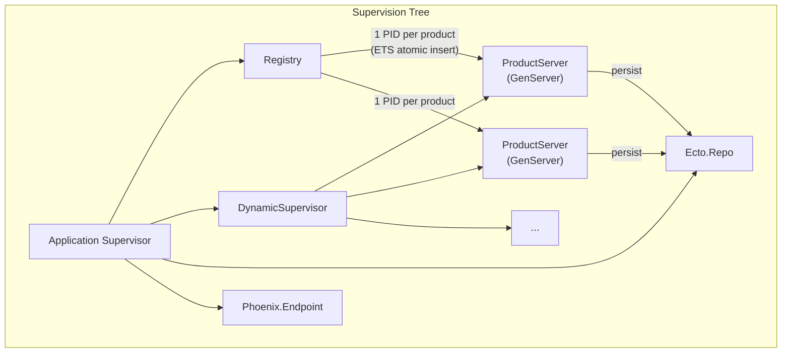
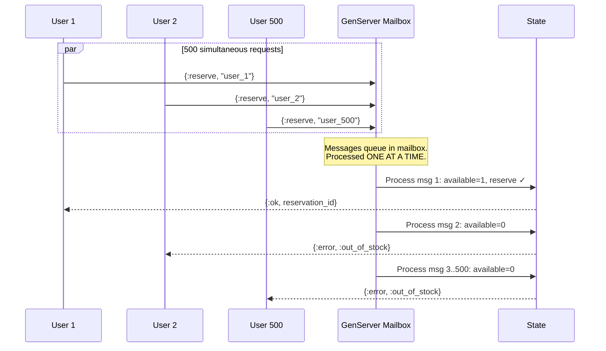
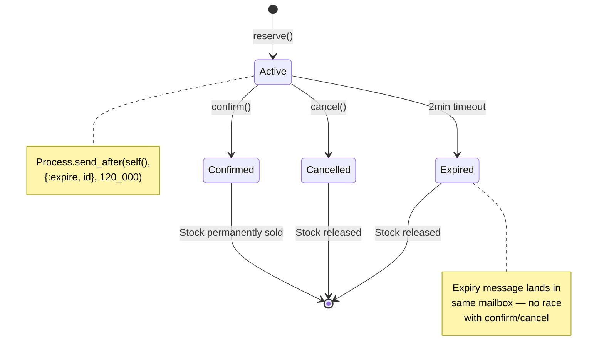
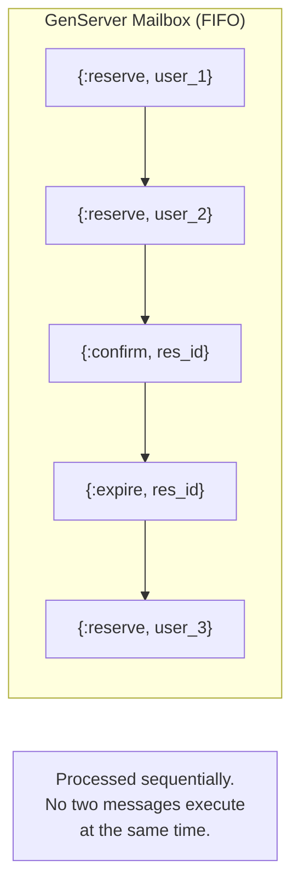

# Inventory Reservation System

Preventing overselling in high-concurrency flash sale scenarios using Elixir/OTP.

500 users click "Buy" at the same instant. Only 10 items in stock. Zero overselling. No manual locks.

## Why Elixir?

This challenge is about **concurrency** — hundreds of simultaneous requests fighting over shared mutable state (inventory count). In most languages, you'd need to build a concurrency layer yourself:

- **Distributed locks** (Redis `SETNX`, Redlock) to prevent race conditions
- **Database-level locking** (`SELECT ... FOR UPDATE`) for every reservation
- **External job queues** for expiry timeouts
- **Manual lock lifecycle management** — acquire, release, handle failures, avoid deadlocks

Elixir doesn't need any of that. The BEAM VM was built for massive concurrency, and the Actor Model (OTP) provides everything out of the box:

| Problem | What other languages need | What Elixir already has |
|---------|--------------------------|------------------------|
| Race conditions | Redis locks, mutexes | GenServer mailbox — processes one message at a time, sequentially. Race conditions are impossible by design. |
| Expiry timeouts | External job queue (Bull, Sidekiq, etc.) | `Process.send_after/3` — built-in timer, expiry message lands in the same mailbox as reserve/confirm/cancel. |
| Process isolation | Worker threads, careful shared memory | BEAM processes — ~2KB each, fully isolated, spawning 500 is trivial. |
| Crash recovery | Try/catch everything, hope for the best | Supervision trees — process crashes, supervisor restarts it, state recovered from DB. |
| Unique resource per product | Distributed lock per resource | Registry — ETS atomic `insert_new`, one process per product guaranteed. |

**The runtime does the hard work.** No external infrastructure, no lock management, no race condition debugging.

## How It Works

### Architecture



### Concurrency Flow — 500 Users Reserve 1 Item



### Reservation Lifecycle & Expiry



### Available Stock Formula

```
Available Stock = Total Stock − Confirmed Sales − Active Reservations
```

- Reservations exceeding available stock fail immediately
- Confirmed purchases are permanent
- Cancelled/expired reservations release stock back to the pool

## Locking Strategy

This system uses the **Actor Model (OTP GenServer)** as its concurrency control mechanism. There are no manual locks, mutexes, or database-level locks.

### 1. No Manual Locks

The GenServer processes one message at a time from its mailbox. Even if 500 processes send `:reserve` simultaneously, they queue in the mailbox and execute sequentially. This eliminates race conditions by design.

### 2. Registry for Unique Processes

Erlang's Registry uses ETS atomic operations (`insert_new`) to guarantee exactly one GenServer per product. Two concurrent `start_child` calls for the same product will never create duplicates.

### 3. Expiry Safety

`Process.send_after/3` schedules expiry messages into the same mailbox. A confirm and an expire arriving at the same instant are still processed one at a time — no inconsistent state is possible.



## Testing Approach

### Unit Tests — Reservation Logic

| Test | What it verifies |
|------|-----------------|
| Reserve when stock available | Returns `{:ok, reservation_id}` |
| Reject when out of stock | Returns `{:error, :out_of_stock}` |
| Multiple reservations up to limit | Exactly N succeed, rest fail |
| Stock tracking | `available_stock` reflects reservations |
| Confirm active reservation | Increments `confirmed_sales`, releases slot |
| Cannot confirm twice | Returns `{:error, :already_confirmed}` |
| Cannot confirm cancelled | Returns `{:error, :reservation_cancelled}` |
| Cannot confirm expired | Returns `{:error, :reservation_expired}` |
| Cancel releases stock | `available_stock` increases by 1 |
| Reserve after cancellation | New user can take the freed slot |
| Cannot cancel confirmed | Returns `{:error, :cannot_cancel_confirmed}` |
| Expiry releases stock | Simulated via direct `send(pid, {:expire, id})` |
| Reserve after expiry | Freed slot is available |

### Concurrency Tests — Parallel Requests

| Test | Setup | Expected Result |
|------|-------|-----------------|
| 500 users, 1 item | `start_product(id, 1)` then 500 `Task.async` | Exactly 1 success, 499 failures |
| 500 users, 10 items | `start_product(id, 10)` then 500 `Task.async` | Exactly 10 successes, 490 failures |
| 100 concurrent `start_product` | Same product ID | All return same PID (no duplicates) |

```bash
mix test              # Run all 17 tests
mix test --trace      # Verbose output
```

## Running the Project

### Prerequisites

- Elixir 1.18+
- PostgreSQL

### Setup

```bash
mix setup             # Install deps, create DB, run migrations
mix phx.server        # Start on http://localhost:4000
```

### Flash Sale Simulator (LiveView UI)

1. Open `http://localhost:4000`
2. Enter product name and stock count
3. Set number of concurrent users (up to 500)
4. Click **Create Users & Product** — see all users listed
5. Click **FIRE** — all users race simultaneously
6. Results table shows winners (with 2-min countdown) and losers
7. **Confirm** / **Cancel** individual or all reservations
8. **Fire Again** — rejected/cancelled users retry for freed stock

## Project Structure

```
lib/
├── inventory_reservation.ex              # Public API
├── inventory_reservation/
│   ├── application.ex                    # Supervision tree
│   ├── product_server.ex                 # Core GenServer
│   ├── repo.ex                           # Ecto Repo
│   └── schema/
│       ├── product.ex                    # Product schema
│       └── reservation.ex               # Reservation schema
└── inventory_reservation_web/
    ├── live/
    │   └── dashboard_live.ex             # Flash sale simulator UI
    ├── router.ex                         # Routes
    └── ...                               # Phoenix boilerplate
test/
└── inventory_reservation_test.exs        # 17 tests across 3 levels
```
